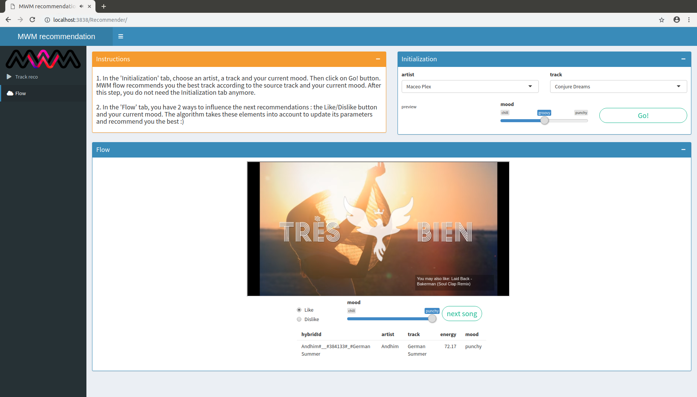
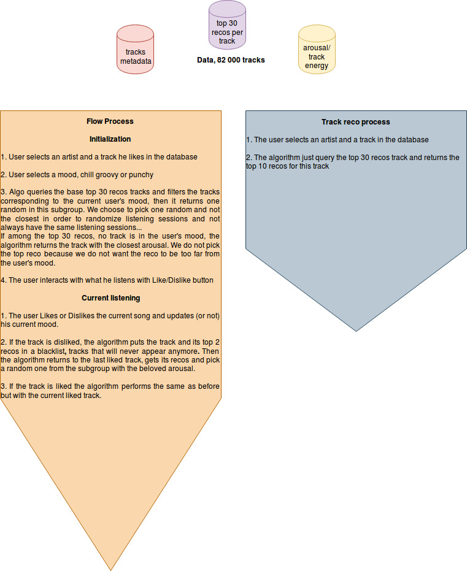

# Track recommendation engine
Shiny webapp to interact with the outputs of **track2vec**, a track recommendation algorithm. **track2vec** uses playlists scrapped from Deezer in order to compute the most similar apps for each track of the database. The app contains 2 features :
* *Basic track recommendation*: from a list of artists and tracks, the user can request the app to get the top 10 most similar tracks in the database. The app allows the user to listen to previews of the recommendations. The user can give feedbacks in order to enhance the system.
* *Flow*: this feature proposes a more friendly way to listen to music. The user selects a track and a mood, then the algorithm proposes the most appropriate track for the user according to these specs. The user interacts with the system and the recommendation gets better with time.



# Project organisation
The organisation of the project is simple.
* ```Recommender``` contains the Shiny app code with the traditional ui.R and server.R.
  * ```ui.R``` contains the user interface, equivalent of html.
  * ```server.R``` makes the computations and the filterings and queries with the data. Equivalent of js.
  * ```utils.R``` contains the useful functions used in the server part
  * ```data``` folder contains ```metadata_vocab.csv```, the 82 000 tracks metadata,  ```arousal_valence.csv```, the arousal scores for each track, ```ordered_recos.csv``` the recommendation results coming from track2vec
  * ```arousalStudy.ipynb``` is an iPython notebook to analyze arousal distributions...
* In the root project directory one can find a ```Dockerfile``` that contains all the instruction to build a docker image with the shinyapp running
* ```init_script.sh``` bash script to launch in order to have the docker container and the app running
* ```results_entreprise.csv``` which stores all the ratings of the
# Install
The project works with Ubuntu 16.04.LTS with a x86-64 architecture, no other environments have been tested for the app to run.
The shiny app runs with docker. You need to install docker [here](https://www.docker.com/).
Once it's done, you can run the project by calling, from the project dir:
```bash
sh init_script.sh
```
then you can access the recommendation engine by requesting ```localhost:3838/Recommender``` from Google-Chrome. Does not work well with the poor Firefox.
On macos, Docker runs in a linux vm so the url is different. One can access it via ```http://[::]:3838```

# Satisfaction results among a panel of 40 music experts from MWM
The *Basic track recommendation* feature allows users to rate the ordered recommendations proposed by the algorithm from a track selected by the user. The user can score **like** or **dislike**. The study has been conducted during one week. 626 ratings have been made in total and the satisfaction rates are the following:
* among all top 10 recommandations : 82% satisfaction
* among the top 5 recommendations : 85% satisfaction
* among the top 3 recommendations : 87% satisfaction
* for the 1st reco : 95% satisfaction.
These results confort the fact that the top recos are the most relevant for the user. They also prove that within the subgroup of the top 10 recos, the results remain coherent. But we need to improve the results to go further.
# Go further
This schema explains how the recommendation works if you are interested

